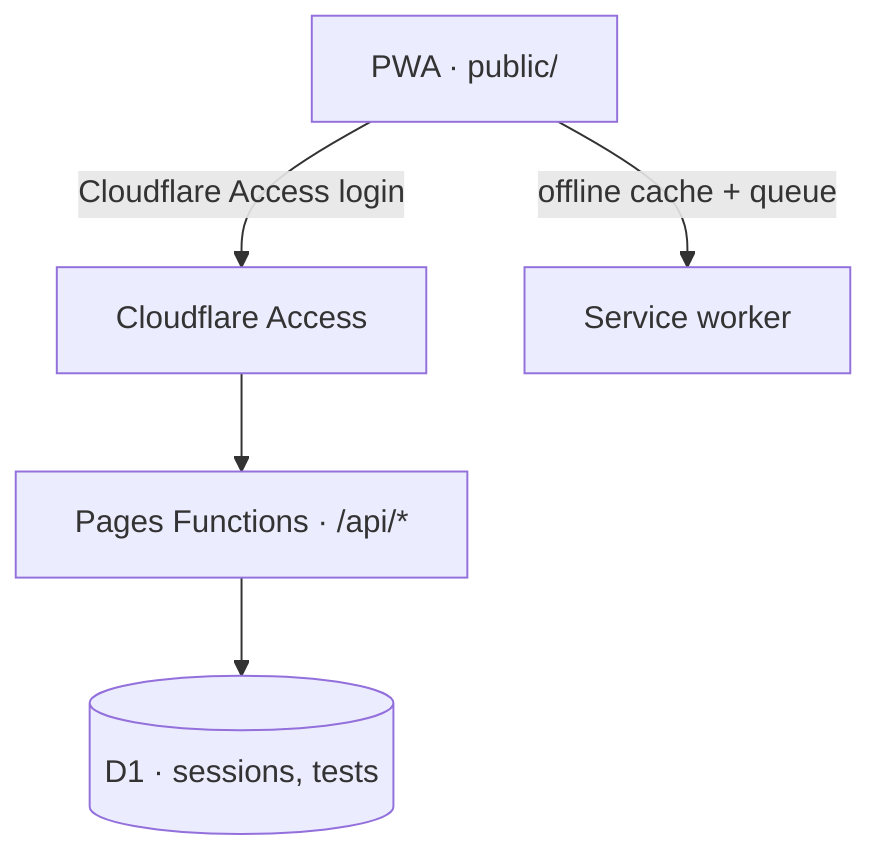

# Ski Strength Log

A training app for one ski season: PSIA Alpine Level 3, Colorado 13er/14er ski descents, and ski-mo racing. It's an offline-first PWA — a session picker, per-set load/reps/RPE logging, a test-day path to an estimated 1RM, and a "Copy for Claude" export — that syncs to Cloudflare so the log survives reinstalling a phone and works from more than one device.

`program.js` is the season's program as data (blocks, sessions, prescriptions, video links); Claude updates it, the app reads it. `app.js` never hand-edits a prescription.

## How it fits together



- **Cloudflare Access** gates the whole deployment — no sign-up flow, no passwords. Every row in D1 is scoped to the Access-authenticated email, so more than one person can use this deployment (each with their own isolated log) just by adding their email to the Access policy — no code change. Today it's one person.
- **D1** is the only backend datastore (free tier: 5 GB, 5M row-reads/day, 100k row-writes/day — a season's log is a few thousand rows).
- The PWA is dependency-light, plain HTML/CSS/JS, no build step. `localStorage` stays the offline-first cache; a small sync module queues mutations for the backend and pulls down other devices' entries.
- Garmin push/pull (planned, not built yet) is a local Python bridge that talks to the Worker API — see the build brief. The app has to work fully with Garmin off.

## Status

- **Phase 0 — hosting**: done. Static PWA on Cloudflare Pages at `training.extraterrestrial.dev`, behind Cloudflare Access.
- **Phase 1 — sync backend**: in progress. D1-backed sessions/tests, offline queue, cross-device sync, `GET /api/export.txt`.
- Phase 2 (push to Garmin), Phase 3 (pull from Garmin), Phase 4 (Claude MCP connector): not started.

## Local development

```bash
npm install
cp .dev.vars.example .dev.vars   # fill in CF_ACCESS_TEAM_DOMAIN / CF_ACCESS_AUD once Access exists;
                                  # set ENVIRONMENT=development + DEV_USER_EMAIL to test the API without Access fronting localhost
npm run dev                      # wrangler pages dev public
```

## Deploy

```bash
npm run deploy                   # wrangler pages deploy public
```

D1 migrations (once Phase 1 lands):

```bash
npm run d1:migrate:remote
```

## Data model

The RPE, notes, and % target logic in the PWA is authoritative. Garmin data (future phases) sits alongside it and never overwrites what was typed in. Units are lb in the app; kg conversions happen at the Garmin boundary only.
